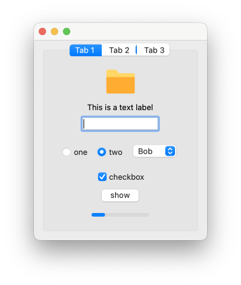
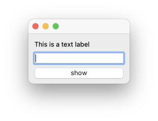

# Faithtop

Faithtop是一个基于[Qt](https://github.com/therecipe/qt)的Go语言的桌面GUI框架, 用于快速编写桌面应用



## [查看文档](https://github.com/gofaith/faithtop/wiki)

---

## 快速开始

1.安装[github.com/therecipe/qt](https://github.com/therecipe/qt)

2.安装`faithtop`

```shell
GO111MODULE=off go get github.com/gofaith/faithtop
```

3.新建`main.go`文件

```go
package main

import (
	. "github.com/gofaith/faithtop"
)

func main() {
	app := NewApp()

	var label ILabel
	var edit IEdit

	Window().DeferShow().CenterWidget(VBox(
		Label2("This is a text label").Assign(&label),
		Edit().Assign(&edit),
		Button2("show").OnClick(func() {
			label.Text(edit.GetText())
		}),
	))

	app.Run()
}
```

4.运行

```shell
qtdeploy -tags=impl build desktop
```



## 更多

[开发文档](https://github.com/gofaith/faithtop/wiki)

## 使用Faithdroid开发的App

[局域网精灵专业版](https://lan-genius.com)
